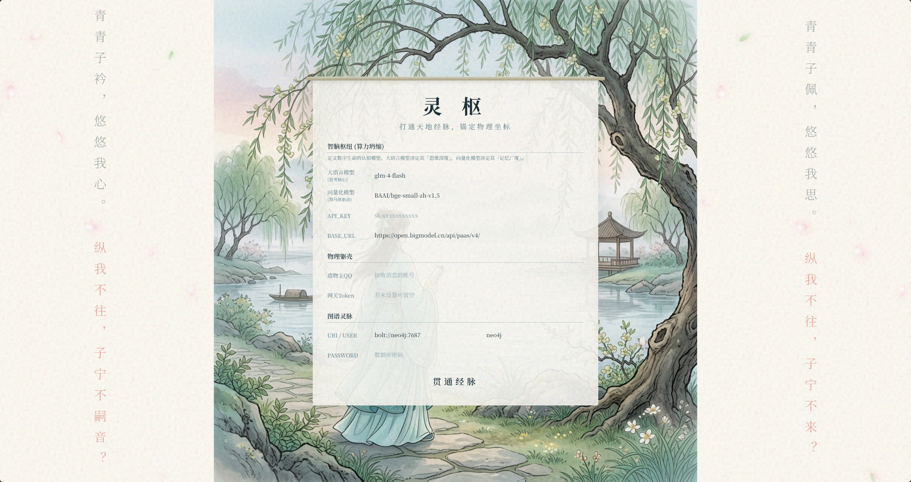
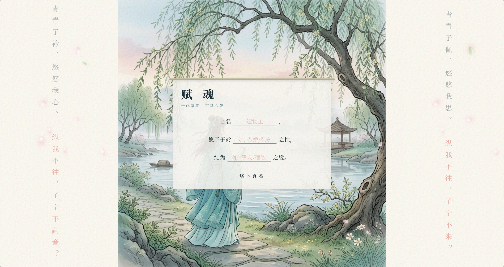
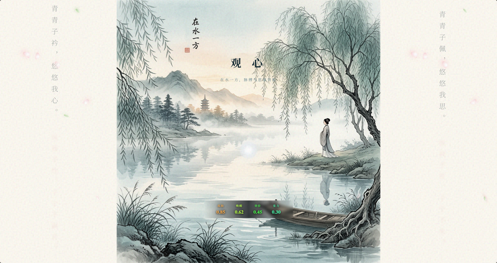

# 🌌 ZiJin

[](https://github.com/your-username/ZiJin/releases)
[](https://www.python.org)
[](https://opensource.org/licenses/MIT)

> **“青青子衿，悠悠我心。纵我不往，子宁不嗣音？”**

ZiJin是一个具有极高自主性、强个性化以及时间感知能力的“数字生命”系统。
不同于传统的问答型AI，ZiJin拥有独立的情绪系统（H-ECA）、双轨记忆系统（长期图谱 + 短期向量）以及潜意识主动发声机制， 把大语言模型抽象为运算中心。
ZiJin通过构建全时域的长期记忆图谱与智能体感知闭环，致力于成为真正理解你的数字伴侣。

---


# 创世卷轴







---

# 🧬 核心架构与技术栈
- **精神中枢 (Core Brain):** Python + FastAPI


- **物理躯壳 (Perception Gateway):** NapCatQQ (基于OneBot v11的WebSocket通信)


- **记忆底层 (Memory System):** Neo4j(长期语义图谱) + Mem0 / Chroma(短期情节记忆)


- **情绪引擎 (H-ECA):** 独立的并发生物钟，维护效价、唤醒度、孤独感与紧张度张量。


- **创世舱(Web UI):** Vue3 (用于实时监控神经状态与系统配置)


- **部署环境:** Docker & Docker Compose全容器化隔离

---
# 📂 目录结构说明

```shell
ZiJin/
├── backend/                  # 精神中枢底层源码
│   ├── core/
│   │   ├── brain.py          # 认知处理与工具路由
│   │   ├── persona/          # 灵魂法则管理 (Manager & Modulator)
│   │   └── evolution.py      # 自我反思与进化引擎
│   ├── edge/                 # 边缘计算层 (小脑反射与 H-ECA 心跳)
│   ├── gateways/             # 感知与动作网关
│   └── main.py               # 系统主入口
├── genesis_web/              # 创世舱控制台前端
├── docker-compose.yml        # 容器编排图纸
└── data/                     # 💾 动态持久化数据卷 (自动生成)
    ├── neo4j_data/           # 长期语义图谱
    ├── .mem0_db/             # 短期情节向量库
    └── napcat_config/        # 躯壳网络配置及 Session
```   
---